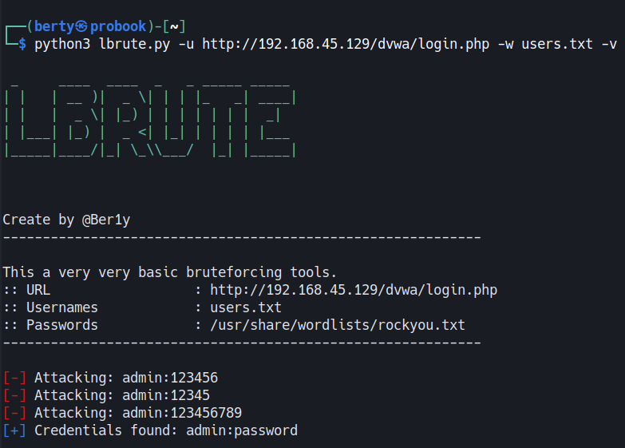

# LBrute
Brute is a very very very basic brute force tool that I created to learn requests, argparse and other python modules.

By default it uses the rockyou.txt password file present in all pentest distributions.

Usage:
```
python3 lbrute.py -u http://<target>/login -w <userwordlist>
```


