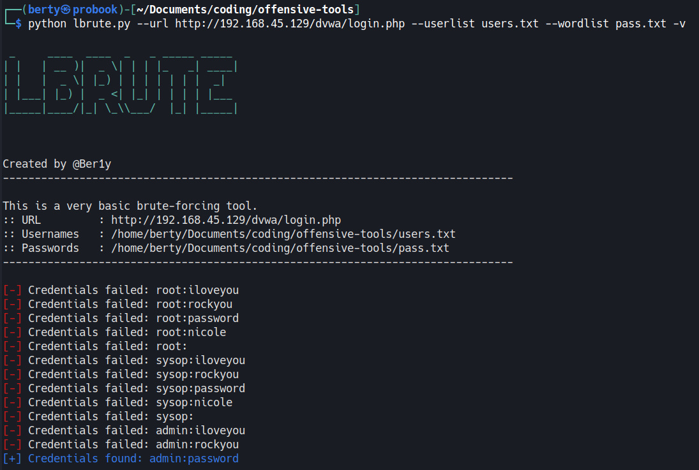

# LBrute
Lbrute is a very very very basic a brute force tool in Python that attempts to automatically log into a login page by testing all possible combinations of usernames and passwords, and displays valid credentials if any are found.
I created to learn requests, argparse and other python modules.

**Usage:**
```
usage: lbrute.py [-h] -u URL -n USERLIST -w WORDLIST [-v]

options:
  -h, --help            show this help message and exit
  -u URL, --url URL     The URL of the login page
  -n USERLIST, --userlist USERLIST
                        The usernames file
  -w WORDLIST, --wordlist WORDLIST
                        The password wordlist file
  -v, --verbose         Show more information about the attack
```

_Exemple:_

in this example I used the [DVWA (Damn Vulnerable Web Application)](https://sourceforge.net/projects/dvwa.mirror/files/latest/download)  login page.

```
python lbrute.py --url http://192.168.45.129/dvwa/login.php --userlist users.txt --wordlist pass.txt -v
```




@Ber1y
